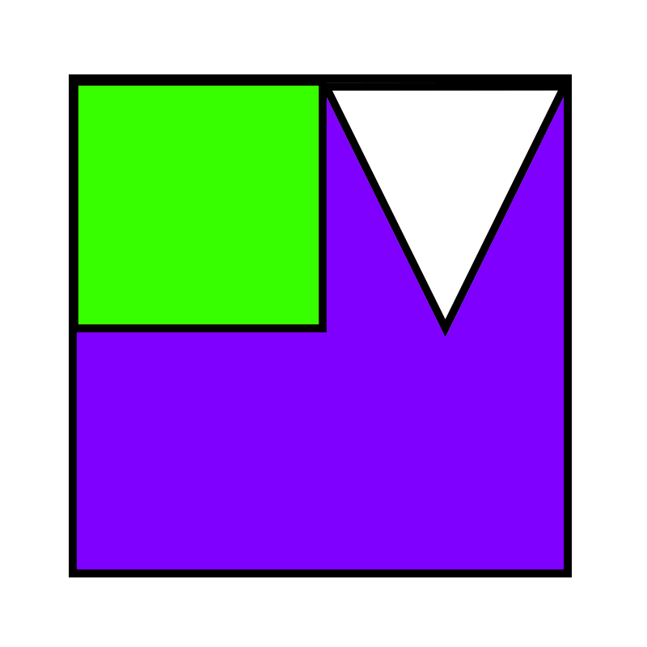

# Blinkable

Blinkable is a lightweight, open-source 2D game/graphics engine written in Python. It focuses on clarity, performance for 2D workflows, and easy extensibility. Blinkable is provided under the Apache License 2.0 — free to use, modify, and distribute. Check the Documentation in wiki please

This repository contains the engine core, example projects, and contributor resources to help you build 2D games, visualizations, or interactive tools.

Table of contents
- About
- Key features
- Design & architecture
- Requirements
- License
- Acknowledgements & credits

About
-----
Blinkable provides:
- A straightforward scene-entity lifecycle for 2D apps
- A simple rendering API with batching primitives for performance
- Sprite and animation helpers
- Input and event systems suitable for games and interactive tools
- Tools and examples to get started fast

Key features
------------
- Scene management with lifecycle hooks (load, start, update, pause, unload)
- Entity-component style patterns (simple composition)
- Sprite sheet and frame-based animation support
- Layered rendering and basic batching to reduce draw calls
- Input system (keyboard, mouse, gamepad support placeholders)
- Simple audio playback & mixing
- Debugging helpers: FPS counter, render bounds overlay, profiler hooks
- Extensible architecture: plug in renderers, resource loaders, or physics

Design & architecture
---------------------
Blinkable is designed around readability and modularity:
- Core loop: fixed-timestep update with variable-time rendering
- Resource Manager: centralized loading/caching of images, audio, and data
- Systems: self-contained modules (rendering, audio, input) with well-defined interfaces

Requirements
------------
- Python 3.8+
- See requirements.txt for the exact pins used in examples

Roadmap
-------
Planned improvements and ideas:
- Formal plugin system (v0.2)
- Official pyglet and SDL2 backends with CI integration
- Integrated tilemap editor example
- Improved editor tooling (scene serializer + inspector)
- Automated performance benchmarks

License
-------
Blinkable is licensed under the Apache License, Version 2.0.
See the bundled LICENSE file for details.

Acknowledgements & credits
--------------------------
- Thank you to early contributors and community testers for feedback and patches.
- Third-party libraries used in examples and backends are credited in their respective folders.

Contact & support
-----------------
- Issues: https://github.com/Exsich14/Blinkable/issues
- Discussions / Ideas: use the Discussions tab in the repo
- For code contribution help, open a PR or ask in an issue and tag @Exsich14
